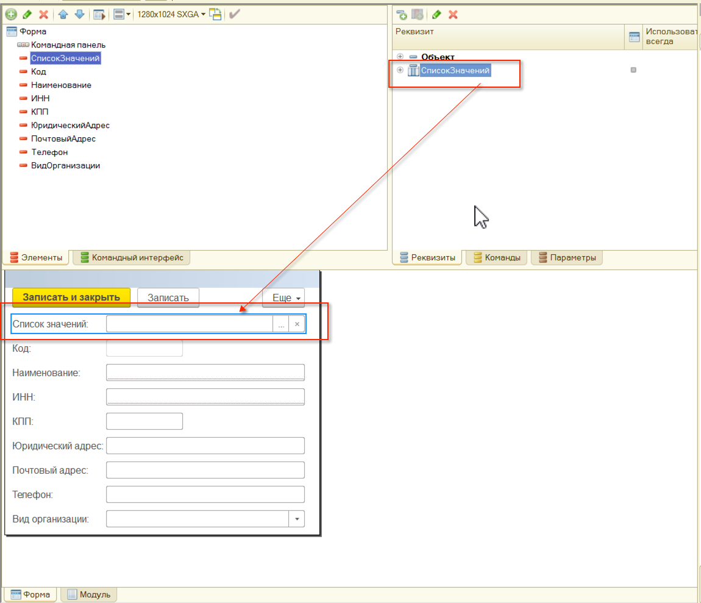
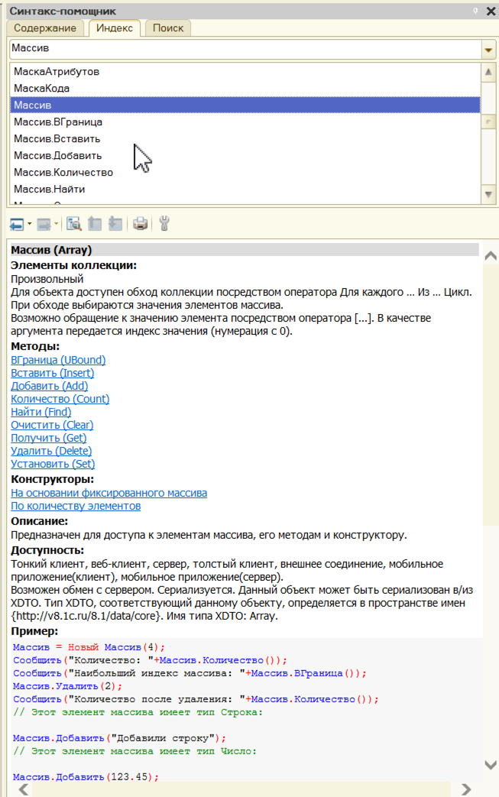
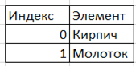
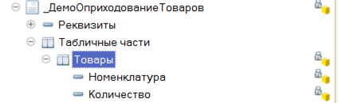
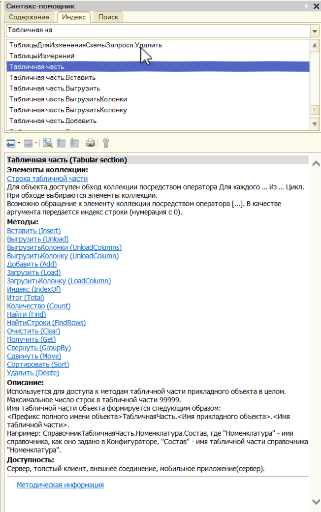

# Коллекции #

Коллекция значений – контейнер, в котором может содержаться обычно любое количество элементов.

## Основные виды коллекций: ##

- Универсальные коллекции значений

	1. Массив;
	2. Структура;
	3. Список значений;
	4. Соответствие;
	5. Таблица значений;
	6. Дерево значений; 

- Коллекции объектов
	
	1. Табличная часть справочника;
	2. Табличная часть документа;
	3. Движения документа;
	4. Набор записей регистра;
	5. т. д.

## Универсальные коллекции  ##

Могут быть объявлены в коде, например:

    ПеременнаяМассив = Новый Массив;
	ПеременнаяСтруктура = Новый Структура;

Могут быть реквизитом формы:

Используются для хранения произвольного набора данных.

Для каждой универсальной коллекции существует описание в синтаксис-помощнике:

В коллекцию можно добавлять, удалять, изменять объекты. Например:

    ЭтоСсылкаНаНоменклатуру1 = Справочники.Номенклатура.НайтиПоНаименованию("Кирпич");
	ЭтоСсылкаНаНоменклатуру2 = Справочники.Номенклатура.НайтиПоНаименованию("Молоток");

	ПеременнаяМассив = Новый Массив;
	
	ПеременнаяМассив.Добавить(ЭтоСсылкаНаНоменклатуру1);
	ПеременнаяМассив.Добавить(ЭтоСсылкаНаНоменклатуру2);

В результате получим вот такой массив:

## Коллекции объектов ##

Используются для хранения и обработки данных метаданными.

Например: Табличная часть "Товары" документа.

Описание работы также есть в синтакс-помощнике:

### Полезные ссылки ###

[http://xn----1-bedvffifm4g.xn--p1ai/articles/%D1%80%D0%B0%D0%B1%D0%BE%D1%82%D0%B0-%D1%81-%D1%83%D0%BD%D0%B8%D0%B2%D0%B5%D1%80%D1%81%D0%B0%D0%BB%D1%8C%D0%BD%D1%8B%D0%BC%D0%B8-%D0%BA%D0%BE%D0%BB%D0%BB%D0%B5%D0%BA%D1%86%D0%B8%D1%8F%D0%BC%D0%B8/](http://xn----1-bedvffifm4g.xn--p1ai/articles/%D1%80%D0%B0%D0%B1%D0%BE%D1%82%D0%B0-%D1%81-%D1%83%D0%BD%D0%B8%D0%B2%D0%B5%D1%80%D1%81%D0%B0%D0%BB%D1%8C%D0%BD%D1%8B%D0%BC%D0%B8-%D0%BA%D0%BE%D0%BB%D0%BB%D0%B5%D0%BA%D1%86%D0%B8%D1%8F%D0%BC%D0%B8/)

[http://howknow1c.ru/jazyk-1s/kollekcii-znachenij-1s.html](http://howknow1c.ru/jazyk-1s/kollekcii-znachenij-1s.html)
