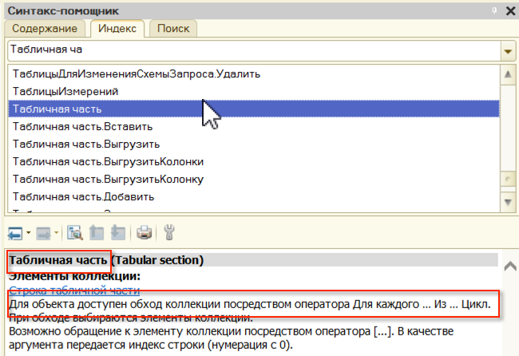
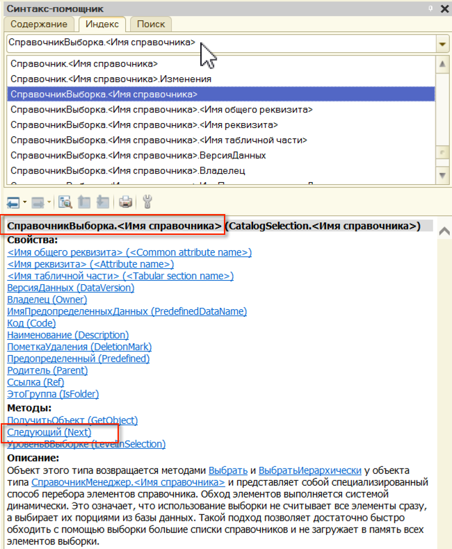

## Циклы ##

Используются для:

- Обхода элементов коллекции по порядку;
- Выполнения определенного кода пока не изменится условие;

## Обход элементов коллекции ##

### Для Каждого Из Цикл ###

Допустим существует массив ПеременнаяМассив со следующим составом:

Тогда мы можем обойти этот массив использую конструкцию:

    Для Каждого <ПеременнаяОбозначающаяТекушийЭлементКоллекции> Из <СамаКоллекция> Тогда
		
		<Код>

	КонецЦикла;

Например так:

	Для Каждого ЭлементМассива Из ПеременнаяМассив Цикл

		Если ЭлементМассива.Наименование = "Молоток" Тогда
			Сообщить("Нашли молоток!");
		КонецЕсли;

	КонецЦикла;

В такой конструкции код исполнится два раза.

- Сначала ЭлементМассива = Кирпич
- Затем ЭлементМассива = Молоток

В результате исполнения кода мы получим сообщение "Нашли молоток" один раз.

### Пока Истина Цикл ###

Существуют коллекции, которые нельзя обойти, использую конструкцию:

	Для Каждого <ПеременнаяОбозначающаяТекушийЭлементКоллекции> Из <СамаКоллекция> Тогда
		
		<Код>

	КонецЦикла;

Например к таким коллекция относятся выборки:

	ВыборкаИзСправочника = Справочники.Номенклатура.Выбрать();

Такие коллекции необходимо обходить используя ключевую функцию Следующий(). Например:

	Пока ВыборкаИзСправочника.Следующий() Цикл
		Если ВыборкаИзСправочника.Наименование = "Молоток" Тогда
			Сообщить("Нашли молоток!");
		КонецЕсли;
	КонецЦикла;

Определить какой вид обхода можно использовать для коллекции можно определить, посмотрев в синтакс-помощник:

Фраза "Для объекта доступен обход коллекции посредством оператора Для Каждого Из Цикл" намекает на то, что это можно использовать:

Наличие метода Следующий() означает, что необходимо использовать эту функцию для обхода коллекции:

## Выполнения определенного кода пока не изменится условие ##

Циклы можно использовать для выполнения определенного кода пока не выполнится определенное условие.

Например, нам необходимо реализовать паузу между двумя сообщениями в пять секунд. Можем сделать это при помощи цикла:

    ДатаНачала = ТекущаяДата();
    
    Сообщить("Первое сообщение");
    
    Пока ТекущаяДата() <= ДатаНачала+5 Цикл
    КонецЦикла;
    
    Сообщить("Второе сообщение");

Пока выполняется условие *ТекущаяДата() <= ДатаНачала+5* цикл будет продолжаться.

## Прерывание одной итерации и всего цикла ##

Можно прервать итерацию цикла, использую *Продолжить*:
	
    ЭтоПерваяСтрока = Истина;

	Для Каждого Строка Из ПеременнаяМассив Цикл

		Если ЭтоПерваяСтрока Тогда
			ЭтоПерваяСтрока = Ложь;
			Продолжить;	
		КонецЕсли;

		Сообщить("УРА!");	

	КонецЦикла;

В этом случае сообщение *УРА!* мы увидим только один раз, так как в первый раз итерация прервется по условию.

Можно прервать весь цикл, использую *Прервать*:

	ЭтоПерваяСтрока = Истина;

	Для Каждого Строка Из ПеременнаяМассив Цикл

		Если ЭтоПерваяСтрока Тогда
			ЭтоПерваяСтрока = Ложь;
			Прервать;	
		КонецЕсли;

		Сообщить("УРА!");	

	КонецЦикла;

В этом случае сообщение *УРА!* мы не увидим, так как весь цикл прервется по условию.

	