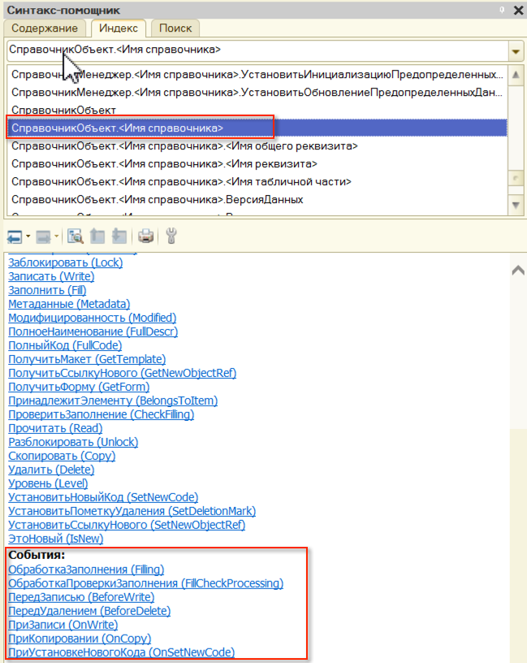
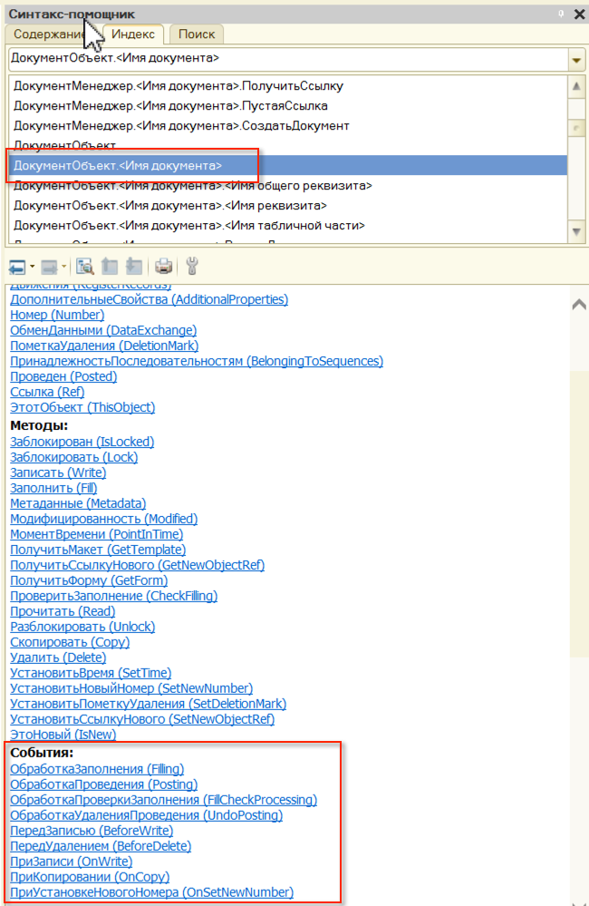

# Объекты #

Объекты конфигурации - это составные элементы, "детали", из которых складывается любое прикладное решение.

Объект имеет определенную структуру и может состоять из:

- Реквизитов;
- Табличных частей;
- Измерений;
- Ресурсов;
- т. д.

Каждый вид объекта имеет собственное предопределенное платформой поведение и это нужно учитывать при проектировании метаданных.

Например:

- У справочника всегда есть наименование и код;
- У документа всегда есть номер и дата;
- Документ может проводиться и записываться;
- Справочник может только записываться;

Переопределять поведение объекта можно, использую типовые события, которые определены для него платформой. Список этих событий с описанием момента вызова и передаваемых параметров можно узнать в синтакс-помощнике.

## Полезные ссылки ##

[http://v8.1c.ru/overview/Term_000000264.htm](http://v8.1c.ru/overview/Term_000000264.htm)