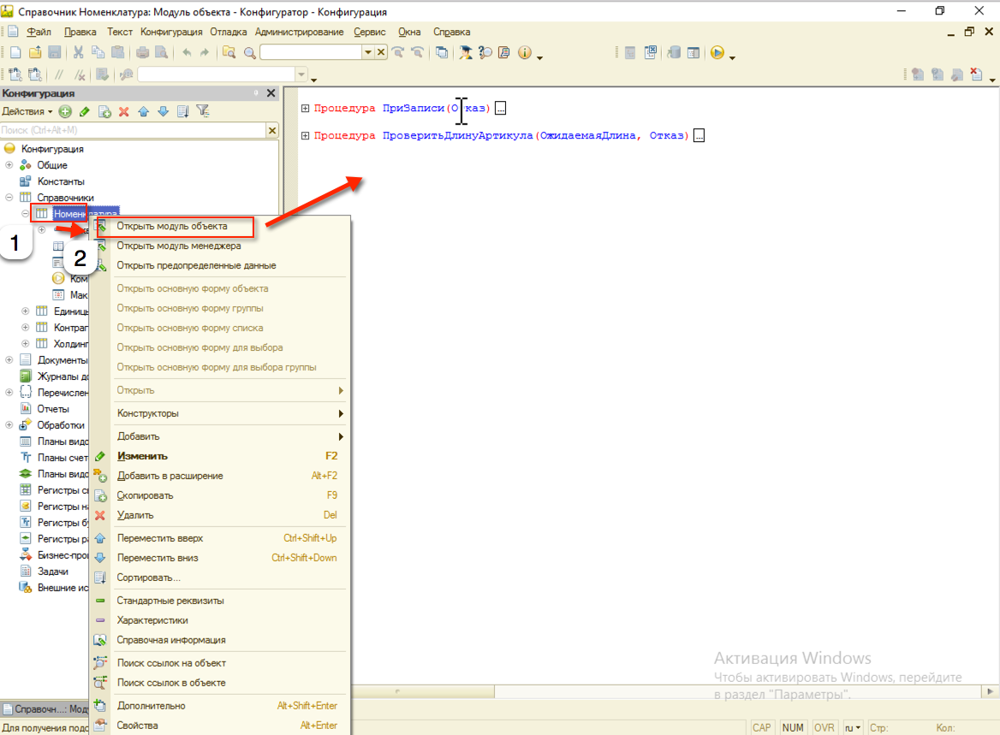

# Справочники #

## Описание вида метаданного ##

Справочники - это прикладные объекты конфигурации. Они позволяют хранить в информационной базе данные, имеющие одинаковую структуру и списочный характер. Это может быть, например, список сотрудников, перечень товаров, список поставщиков или покупателей.

Каждый элемент справочника характеризуется кодом и наименованием. Система поддерживает режим автоматической нумерации элементов, при котором она самостоятельно может генерировать код для нового элемента справочника.

Помимо кода и наименования, каждый элемент справочника, как правило, содержит некоторую дополнительную информацию, которая подробно описывает этот элемент. Например, для товара это может быть информация об артикуле, упаковке и т.п. Набор такой информации является одинаковым для всех элементов конкретного справочника, и для ее хранения служат реквизиты справочника.

Помимо кода и наименования, каждый элемент справочника, как правило, содержит некоторую дополнительную информацию, которая подробно описывает этот элемент. Например, для товара это может быть информация об артикуле, упаковке и т.п. Набор такой информации является одинаковым для всех элементов конкретного справочника, и для ее хранения служат реквизиты справочника.

Справочники могут поддерживать иерархическое расположение элементов. Например, в справочнике Номенклатура могут быть созданы группы: Бытовая техника, Обувь, Продукты и т.д., в которых располагаются элементы, относящиеся к этим группам. Кроме того группы справочника могут включать в себя и другие группы, создавая тем самым многоуровневую иерархическую структуру.

В справочниках возможен и другой вид иерархии, при котором элементы справочника будут относиться не к группам, а к другим элементам этого же справочника. Такой вид иерархии может использоваться, например, при создании справочника Задачи, где одна задача может включать в себя несколько других задач.

Разные справочники могут находиться в состоянии подчинения, т.е. элементы одного справочника могут быть подчинены элементам или группам другого справочника. Например, справочник Кассы может быть подчинен справочнику Организации. Тогда при оформлении кассовых документов для некоторой организации можно будет выбрать кассу не среди всех имеющихся в программе касс, а среди касс, существующих только в этой организации.

Справочники допускают также создание предопределенных элементов, которые существуют в справочнике всегда, вне зависимости от действий пользователя. Такие элементы справочника создаются разработчиком при разработке прикладного решения и не могут быть удалены или перемещены пользователем.

Например, если в основном прикладное решение будет внедряться на предприятиях одного государства, России, в справочник Страны мира сразу же можно добавить предопределенный элемент Россия, поскольку он понадобится подавляющему большинству пользователей.

## Работа с объектом справочника ##

Описание поведения объекта справочника необходимо осуществлять в модуле объекта справочника.

Описание поведения объекта можно выполнять при помощи типовых событий модуля объекта:

- ПередЗаписью
- ПриЗаписи
- ПриУстановкеНовогоКода
- ПриКопировании
- ОбработкаЗаполнения
- ПередУдалением
- ОбработкаПроверкиЗаполнения

Описание каждой процедуры можно найти в синтакс-помощнике.

## Полезные ссылки ##

[http://v8.1c.ru/overview/Term_000000168.htm](http://v8.1c.ru/overview/Term_000000168.htm)