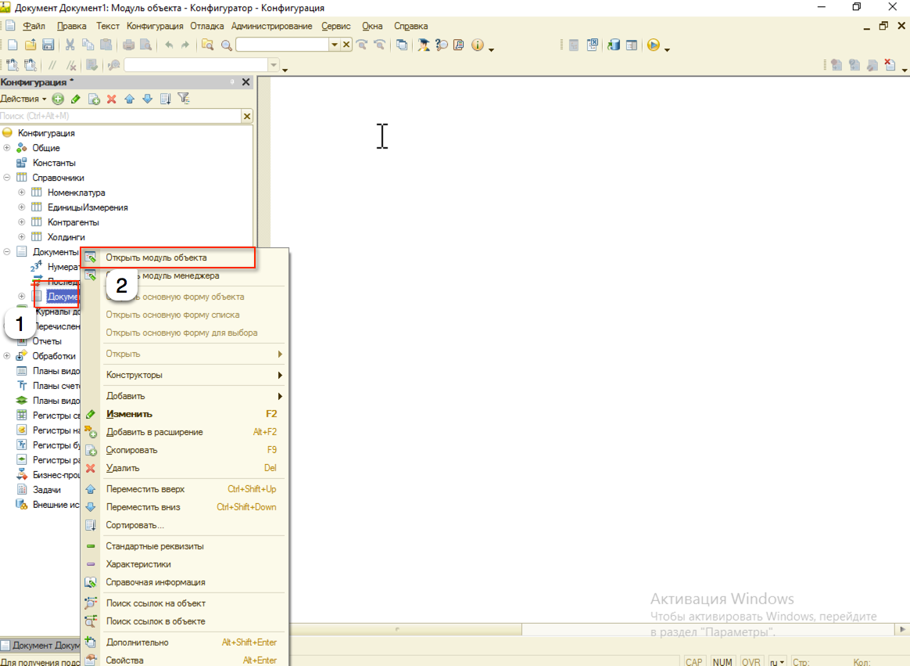

# Документы #

## Описание вида метаданного ##

Документы - это прикладные объекты конфигурации. Они позволяют хранить в прикладном решении информацию о совершенных хозяйственных операциях или о событиях, произошедших в "жизни" предприятия вообще. Это могут быть, например, приходные накладные, приказы о приеме на работу, счета, платежные поручения и т.д.

Каждый документ характеризуется номером, датой и временем. Система поддерживает режим автоматической нумерации документов, при котором она самостоятельно может генерировать номер для нового документа. Кроме этого система позволяет осуществлять контроль уникальности номеров документов, не разрешая создавать документы с одинаковыми номерами.

Система автоматически поддерживает режим, при котором уникальность номеров и автоматическая нумерация могут выполняться в пределах определенного периода (день, месяц, квартал, год). Например, если периодичность установлена год, то с нового года система опять начнет нумерацию указанных документов с 1.

Важными характеристиками документа являются дата и время. Они позволяют установить строгую временную последовательность совершения операций. Таким образом, документы могут отличаться друг от друга не только номером, но и своим положением на временной оси. В результате всегда можно сказать, какая из двух операций была совершена раньше.

Помимо номера, даты и времени, каждый документ, как правило, содержит некоторую дополнительную информацию, которая подробно описывает этот документ. Например, для документа Поступление товаров и услуг это может быть информация о поставщике товаров (контрагенте), складе, на который приходуются товары и т.п. Набор такой информации является одинаковым для всех документов конкретного вида, и для ее хранения служат реквизиты документа.

Кроме этого, каждый документ может содержать некоторый набор информации, которая одинакова по своей структуре, но различна по количеству, для разных документов. Например, для документа Поступление товаров и услуг это может быть информация о товарах, поступивших на предприятие (наименование, количество, и т.д.), серийных номерах и возвратной таре. Для хранения подобных данных служат табличные части документа.

## Проведение документа ##

Важным свойством документа является возможность его проведения. Если документ проводится, то он может изменить состояние тех или иных учитываемых данных. Если же документ не является "проводимым" это значит, что событие, которое он отражает, не влияет на состояние учета, который ведется в данном прикладном решении.

Например, документ Поступление товаров и услуг при своем проведении может вносить изменения в состояние расчетов с поставщиками, в учет остатков товаров, в состояние заказов покупателей и другие учетные данные.

## Работа с объектом документа ##

Описание поведения объекта документа необходимо осуществлять в модуле объекта документа.

Описание поведения объекта можно выполнять при помощи типовых событий модуля объекта:

- ПриУстановкеНовогоНомера
- ПриКопировании
- ОбработкаЗаполнения
- ПередЗаписью
- ПриЗаписи
- ПередУдалением
- ОбработкаПроведения
- ОбработкаУдаленияПроведения
- ОбработкаПроверкиЗаполнения

Описание каждой процедуры можно найти в синтакс-помощнике.

## Полезные ссылки ##

[http://v8.1c.ru/overview/Term_000000169.htm](http://v8.1c.ru/overview/Term_000000169.htm)