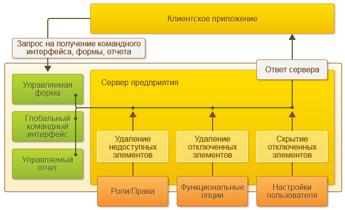
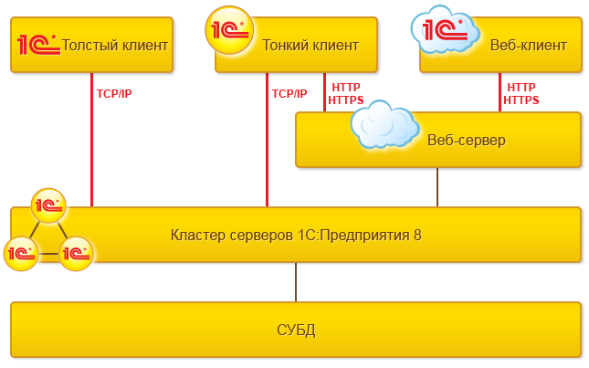
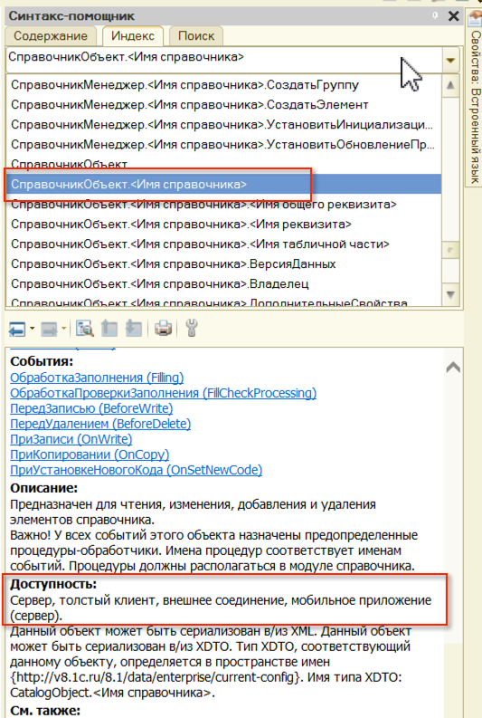

# Клиент-серверная архитектура #

В 8.2 произошло явное разделение архитектуры на клиент и сервер.

Клиент и сервер:

На сервере выполняются:

- Запросы к базе данных,
- Запись данных,
- Проведение документов,
- Различные расчеты,
- Выполнение обработок,
- Формирование отчетов,
- Подготовка форм к отображению.

На клиенте выполняется:

- Получение и открытие форм,
- Отображение форм,
- «Общение» с пользователем (предупреждения, вопросы…),
- Небольшие расчеты в формах, требующие быстрой реакции (например, умножение цены на количество),
- Работа с локальными файлами,
- Работа с торговым оборудованием.

Общение между клиентом и сервером может проходить по протоколам:

- tcp/ip;
- http;
- https;

Отражение клиент-серверной архитектуры на работе разработчика:

- Деление кода в форме на клиентский и серверный;
- Деление общих модулей на клиентские и серверные;

## Виды инструкций на форме ##

- &НаКлиенте

Код будет исполняться в клиентском приложении.

- &НаСервере

Код будет исполняться на сервере.

- &НаСервереБезКонтекста

Код будет исполняться на сервер, но данные формы с клиента передаваться не будут.

- &НаКлиентеНаСервереБезКонтекста

Код будет исполнен там, откуда он был вызван.

## Стратегия работы разработчика ##

- Минимизация количества серверных вызовов;
- Минимизация количества передаваемых данных между клиентом и сервером;

## Применимость типов данных на клиенте и сервере ##

Каждый тип данных и каждая функция может применяться только там, где он доступен. Доступность типов данных можно узнать в синтакс-помощнике:

## Возможность передачи типа данных между клиентом и сервером ##

- Некоторые типы данных можно передавать между клиентом и сервером (например, структура, массив, соответствие);
- Некоторые типы данных нельзя передавать между клиентом и сервером (например, таблица значений);

## Полезные ссылки ##

[http://v8.1c.ru/overview/Term_000000033.htm](http://v8.1c.ru/overview/Term_000000033.htm)