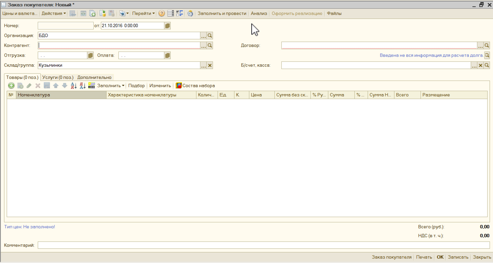
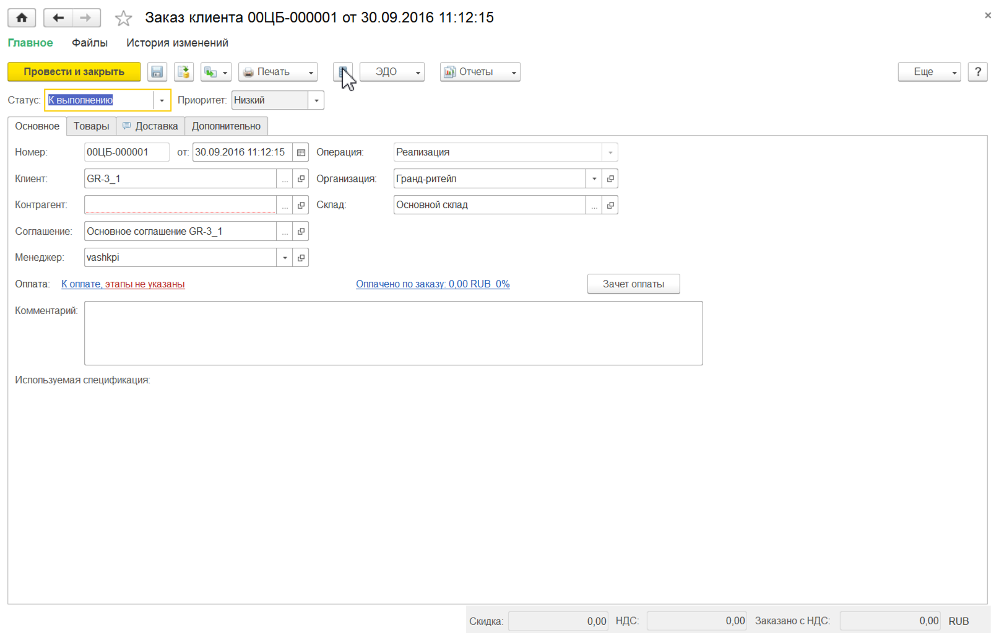
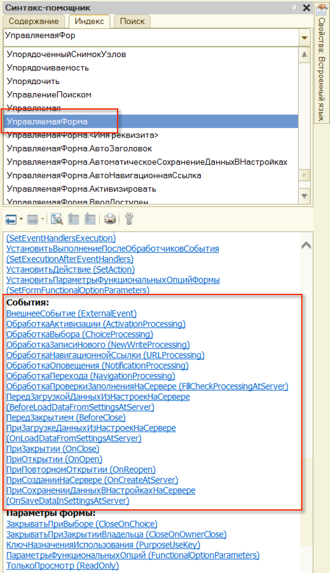
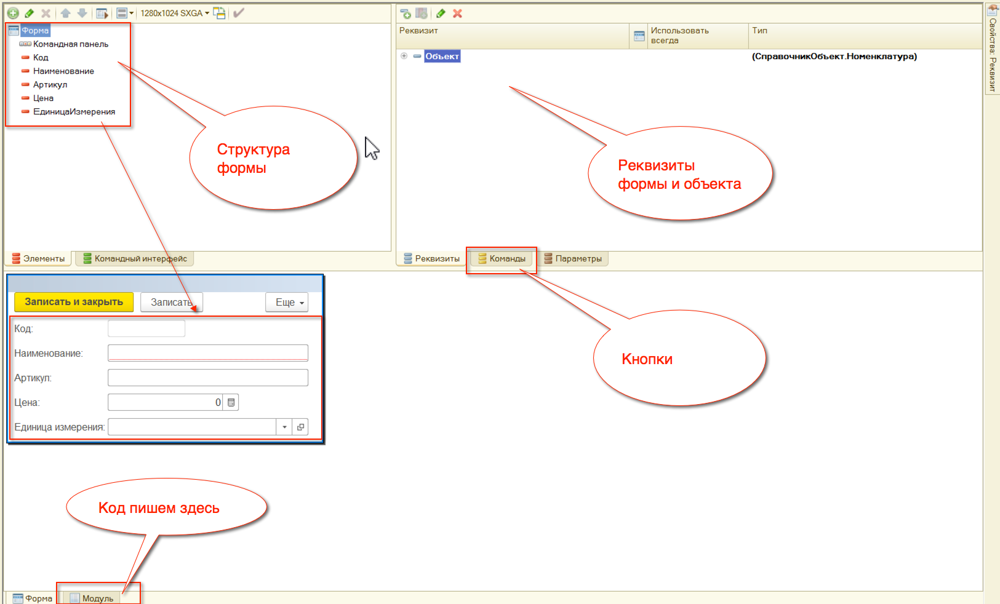

# Формы #

## Приложение ##

Приложение может быть:

- Обычное;
- Управлямое;
- Такси.

## Формы могут быть управляемые и обычные ##

Обычные формы:

- Только толстый клиент;
- Нет разделения на клиент-сервере;
- Привязки;

Управляемые формы:

- Толстый и тонкий клиент;
- Разделение на клиент-сервер;
- Удобный конструктор форм;

## У форм есть события ##

## Виды форм ##

- Общая форма;
- Форма объекта;
- Форма записи;
- Форма списка;
- Форма выбора;
- Форма обработки;
- Форма отчета.

## Конструктор управляемой формы ##

## Взаимодействие с формой происходит через события ##

Переменные управляемой формы:

- ЭтаФорма (доступ к самой форме);
- Элементы (доступ к элементам (внешнему отображению формы));
- Объект (доступ к объекту формы, если он есть);
- К реквизитам формы можно обращаться по имени.

События существуют у самой формы. Пример для управляемой формы:

- ПриСозданииНаСервере;
- ПриОткрытии;
- ПриПовторномОткрытии;
- т. д.

У элементов формы также есть события. Например поле ввода:

- ПриИзменении
- НачалоВыбора
- Открытие
- т. д.