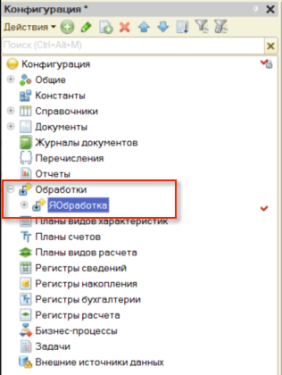
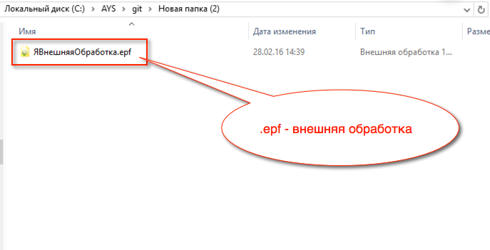

# Обработки #

## Понятие обработки ##

Обработки - это прикладные объекты конфигурации. Они предназначены для выполнения различных действий над информацией.

Например, с их помощью можно выполнять удаление из системы устаревших данных, импорт информации из других систем и многое другое. Характер выполняемых в этом случае действий отражает название объекта конфигурации — Обработка, так как в результате информация, хранящаяся в системе, претерпевает какие-либо изменения.

Обработка может содержать одну или несколько форм, с помощью которых, при необходимости, можно организовать ввод каких-либо параметров, влияющих на ход алгоритма. Вывод результатов выполнения алгоритма на экран и принтер осуществляется с помощью конструктора запроса с обработкой результата.

Основное отличие обработки от отчета заключается в том, что отчет может использовать схему компоновки данных. В остальном обработка не отличается от отчета.

## Обработка может быть встроена в конфигурацию ##

## Обработка может быть внешней ##

## Полезные ссылки ##

[http://v8.1c.ru/overview/Term_000000601.htm](http://v8.1c.ru/overview/Term_000000601.htm)

[http://programmist1s.ru/dopolnitelnyie-otchetyi-i-obrabotki-1s-8-3/](http://programmist1s.ru/dopolnitelnyie-otchetyi-i-obrabotki-1s-8-3/)