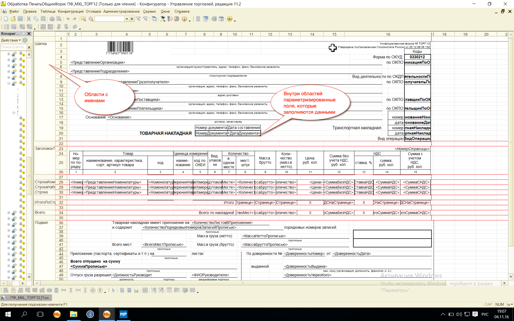
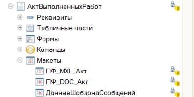

# Печатные формы #

## Макет ##

Печатные формы формируются из макетов (шаблонов)

## Алгоритм заполнения формы ##

В общем алгоритм заполнения подразделяется на следующие этапы:

- Сбор данных для печати;
- Получение макета;
- Заполнение параметров областей макета и их вывод;
- Отображение табличного документа на экране.

## Синтаксис ##

Табличный документ, который мы будем заполнять:

    ТабДок = Новый ТабличныйДокумент;
	ТабДок.Показать();

Макет, который хранит образец печатной формы:

	Макет = КакойТоОбъект.ПолучитьМакет("ИмяМакета");

Макет хранится в разделе макетов объекта:

Область - именованная часть макета, которая содержит параметры:

	Шапка = Макет.ПолучитьОбласть("Шапка");
	Шапка.Параметры.Заполнить(Данные);
	ТабДок.Вывести(Шапка);

Выводим шапку и отображаем документ на экране:

	ТабДок = Новый ТабличныйДокумент;
	
	Макет = КакойТоОбъект.ПолучитьМакет("ИмяМакета");
	
	Шапка = Макет.ПолучитьОбласть("Шапка");
	Шапка.Параметры.Заполнить(Данные);
	ТабДок.Вывести(Шапка);

	ТабДок.Показать();

## Полезные ссылки ##

