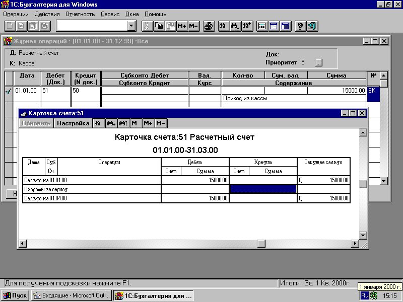
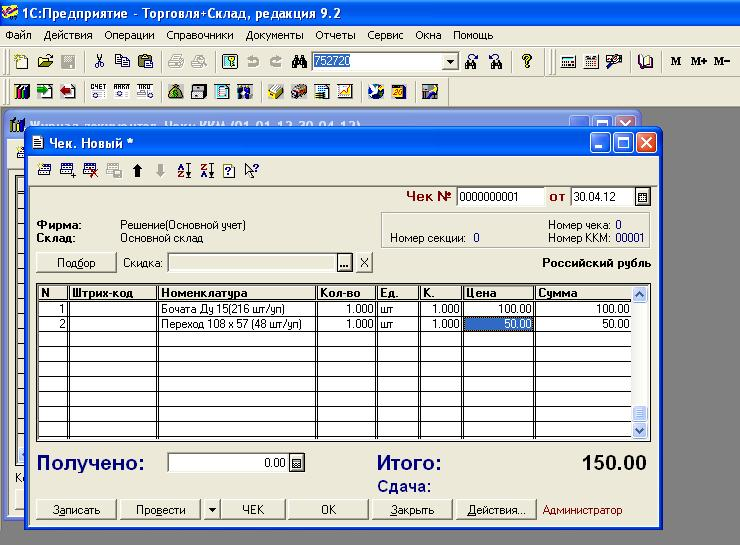
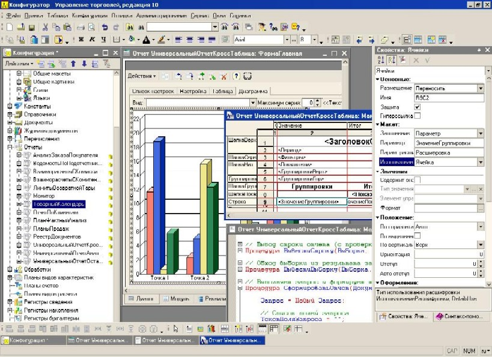
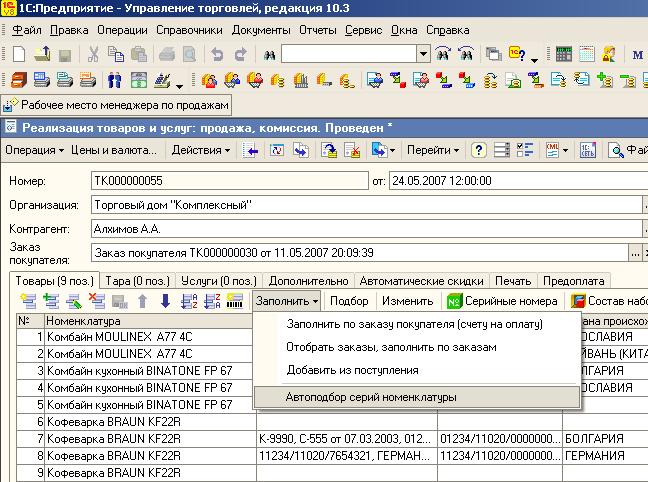
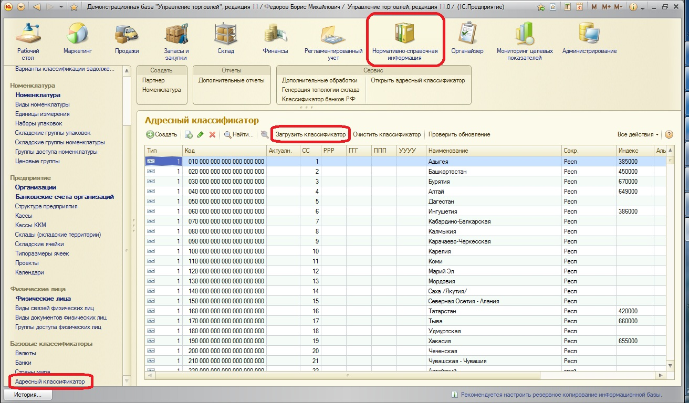
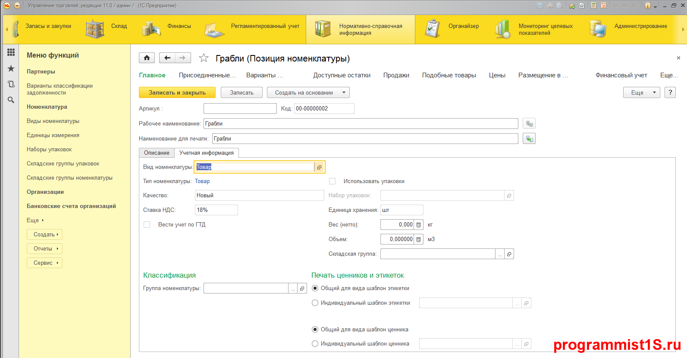

# Виды платформ 1С #

## 6.0 ##

## 7.7 ##

Три основные конфигурации:

- 1С: Торговля и склад;
- 1С: Бухгалтерия;
- 1С: Зарплата и кадры.

## 8.0 ##

Новые версии:

- 1С: Управление торговлей 8;
- 1С: Бухгалтерия 8;
- 1С: Зарплата и управление персоналом 8.

Новый синтаксис языка.

## 8.1 ##

Происходит развитие платформы

## 8.2 ##

- Появляется управляемое приложение;
- Тонкий и веб-клиент;
- Написание форм в клиент-серверном варианте.

## 8.3 ##

- Появляется интерфейс такси;
- Кроссплатформенность;
- Возможность делать мобильные приложения.

## 8.4 Ознакомительная ##

- Сервис-ориентированная архитектура
- Отказоустойчивый реестр и новый главный менеджер
- Встроенный веб-сервер
- Балансировщик нагрузки
- Развертывание информационных баз из командной строки
- REST интерфейс администрирования

## Полезные ссылки ##

[http://programmist1s.ru/istoriya-razvitiya-1s-predpriyatiya/](http://programmist1s.ru/istoriya-razvitiya-1s-predpriyatiya/)