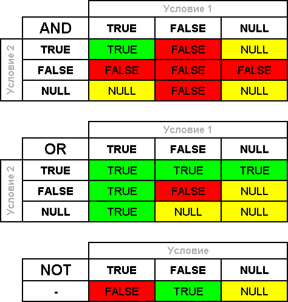

# Типы данных #

## Примитивные типы ##

- Булево;
- Строка;
- Число;
- Дата;
- NULL;
- Неопределено;
- Тип;

## Булево - Истина, Ложь. Булева логика ##

## Строка - "Ура, мы изучаем 1С!"; ##

Строка + Строка = Строка;

    "Ура, мы изучаем 1С!" + " " + " Да, да, изучаем!" = "Ура, мы изучаем 1С! Да, да, изучаем!";

## Число - 1; ##

Число - это 1;

1+1 = 2;

"1"; - это строка;

"1"+"1"="11";

Строка + Число = Строка;

    "Ура, мы изучаем " + 1 + "С!" = "Ура, мы изучаем 1С!";

## Дата - 08.10.2016 09:00:00; ##

Состоит из даты и времени

    08.10.2016 09:00:00 + 1 = 08.10.2016 09:00:01;

## NULL - отсутствие значения ##

Характеризует отсутствие значения.

Появляется в выборках из запросов.

## Неопределено - NULL для 1С-ников ##

Данный тип  появляется если у нас есть некая переменная и она не инициализировна.

Тип данных Неопределено возвращают многие функции встроенного языка, если действие не может быть выполнено.

## Тип ##

Основное применение этого типа данных заключается в том, чтобы сравнить значение некой переменной или реквизита базы данных с конкретным типом.

Вызывается функциями:

- Тип();
- ТипЗнч();

## Преобразование типов ##

Один тип при определенных условиях может стать другим.

Например: 

    "Ура, мы изучаем " + 1 + "С!" = "Ура, мы изучаем 1С!";
    "Ура, мы изучаем 1С! " + Истина + ", "+ Истина +", изучаем!" = "Ура, мы изучаем 1С! Да, да, изучаем!";

Преобразование может происходить при помощи специальных функций:
    
    Строка(1) = "1";
    Число("10") = 10;
    Дата(2016,10,08,09,00,00) = 08.10.2016 09:00:00;

## Полезные ссылки ##

[http://v8.1c.ru/overview/Term_000000586.htm](http://v8.1c.ru/overview/Term_000000586.htm)

[http://xn----1-bedvffifm4g.xn--p1ai/articles/%D0%BF%D1%80%D0%B8%D0%BC%D0%B8%D1%82%D0%B8%D0%B2%D0%BD%D1%8B%D0%B5-%D1%82%D0%B8%D0%BF%D1%8B-%D0%B4%D0%B0%D0%BD%D0%BD%D1%8B%D1%85-%D0%B8-%D0%B8%D1%85-%D1%84%D1%83%D0%BD%D0%BA%D1%86%D0%B8%D0%B8/](http://xn----1-bedvffifm4g.xn--p1ai/articles/%D0%BF%D1%80%D0%B8%D0%BC%D0%B8%D1%82%D0%B8%D0%B2%D0%BD%D1%8B%D0%B5-%D1%82%D0%B8%D0%BF%D1%8B-%D0%B4%D0%B0%D0%BD%D0%BD%D1%8B%D1%85-%D0%B8-%D0%B8%D1%85-%D1%84%D1%83%D0%BD%D0%BA%D1%86%D0%B8%D0%B8/)