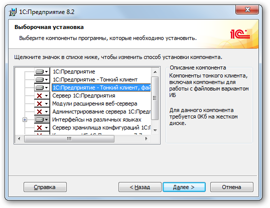

#Установка#

## Установка платформы ##

Состав:

- 1С: Предприятие - толстый клиент + конфигуратор;
- 1С: Тонкий клиент (если конфигурация на управляемом приложении с СУБД);
- 1С: Тонкий клиент для файлового варианта (если конфигурация на управляемом приложении без СУБД);
- Сервер 1С: Предприятия (если база будет на СУБД);
- Модули расширения веб-сервера (если будем публиковать базу в интернет или в локальной сети через веб-сервер Apache или IIS);
- Администрирование сервера 1С: Предприятия (если у нас есть сервер 1С, тогда нужна и консоль управления сервером);
- Интерфейсы на различных языках;
- Сервер хранилища конфигураций 1С: Предприятия.

## Установка конфигурации ##

Есть множество конфигураций:

[http://solutions.1c.ru/](http://solutions.1c.ru/)

Основные:

- 1С: Управление торговлей;
- 1C: Бухгалтерия;
- 1С: Зарплата и управление персоналом;
- 1С: ERP;
- 1С: Управление производственным предприятием;
- 1С: Комплексная автоматизация.

Конфигурации поставляются в виде шаблонов:

- Полный дистрибутив;
- Дистрибутив обновления.

Берут основные конфигурации здесь: [https://users.v8.1c.ru/](https://users.v8.1c.ru/)

## Версия для обучения программированию ##

Скачать можно бесплатно здесь: [http://online.1c.ru/catalog/free/18610119/](http://online.1c.ru/catalog/free/18610119/)

## 1С: Деньги ##

Декстоп: [http://online.1c.ru/catalog/programs/program/14229054/](http://online.1c.ru/catalog/programs/program/14229054/)

Android: [https://play.google.com/store/apps/details?id=ru.publishing1c.minimoney](https://play.google.com/store/apps/details?id=ru.publishing1c.minimoney)

iOS: [https://itunes.apple.com/ru/app/miniden-gi/id917572823](https://itunes.apple.com/ru/app/miniden-gi/id917572823)

## Полезные ссылки: ##

[http://programmist1s.ru/kak-ustanovit-1s-buhgalteriyu-i-drugie-konfiguratsii-kak-postavit-1s/](http://programmist1s.ru/kak-ustanovit-1s-buhgalteriyu-i-drugie-konfiguratsii-kak-postavit-1s/)